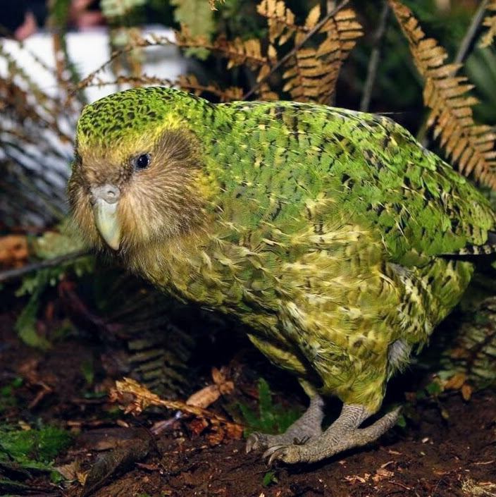

# P031-KAKAPO-20A

  

 

KAKAPO-2A is a compact, all-in-one control and power platform that's designed to be the heart of your robot, removing setup headaches so you can focus on building and battling. It builds on the proven WEKA dual DC motor architecture, now adding integrated power switching, distribution, and dedicated outputs for light-weight servos or ESCs; streamlining your electronics without compromise.

The product is named after the [Kākāpō](https://en.wikipedia.org/wiki/K%C4%81k%C4%81p%C5%8D), a nocturnal flightless parrot endemic to New Zealand.

Developed, assembled, and tested in [Christchurch, New Zealand](https://www.google.co.nz/maps/place/Christchurch+New+Zealand), by Connor Benton.